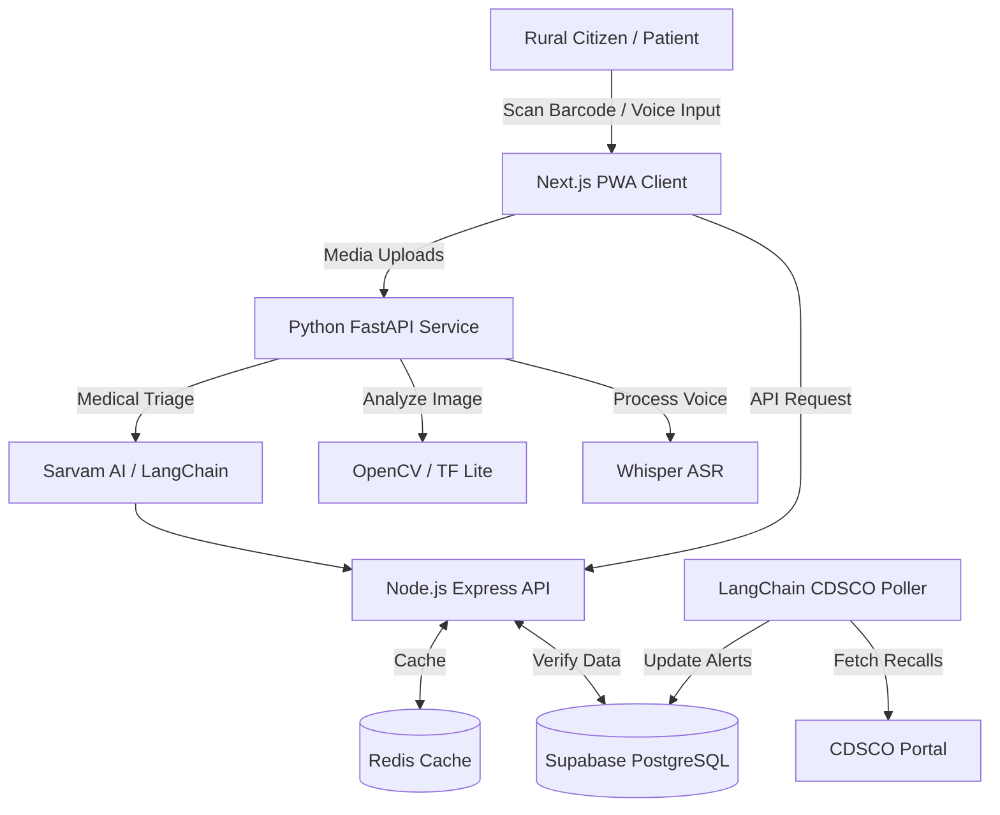

<div align="center">


<br/><br/>

# 🩺 SahiDawa — सही दवा

### India's First Open-Source Citizen Medicine Verifier & Rural Health Bridge

**Scan any medicine. Verify it's real. Find safe pharmacies near you. Talk to an AI doctor in your language.**

_Built for Bharat. Not just India._

<br/>

[**Report a Bug**](https://github.com/RatLoopz/sahidawa-india/issues/new?template=bug_report.md) · [**Request a Feature**](https://github.com/RatLoopz/sahidawa-india/issues/new?template=feature_request.md) · [**Join Discord**](https://discord.gg/6Qa6VuE6) · [**Read the Docs**](./docs/)

</div>

---

## 🚨 The Problem We're Solving

India has a three-layer healthcare crisis that **no existing platform solves simultaneously**:

| Problem                                                             | Scale                      | Current Solution                                             |
| ------------------------------------------------------------------- | -------------------------- | ------------------------------------------------------------ |
| 12–25% of medicines in India are fake or substandard                | 1.4 billion people at risk | ❌ None — no citizen-facing verifier exists                  |
| 65% of population is in rural areas with almost no qualified doctor | 900M+ people               | ❌ eSanjeevani exists but requires English + stable internet |
| 22 official languages — health info mostly in English/Hindi only    | 500M+ non-Hindi speakers   | ❌ No voice-first multilingual health app                    |

> **Real incident:** In July 2025, Delhi Police busted a counterfeit medicine ring supplying fake Johnson & Johnson and GSK medicines — made of chalk powder and starch — all the way into government hospitals. Patients had zero way to verify these medicines before consuming them.

**SahiDawa fixes this. For free. Forever. Open source.**

---

## ✨ What SahiDawa Does

### 💡 The Core Workflow

- **📱 Scan Medicine** ➔ 🔍 **AI Verifies (CDSCO)** ➔ ✅ **Real** / ⚠️ **Suspicious** / ❌ **Fake**
- **🗣️ Speak Symptoms** ➔ 🤖 **AI Triage (22 Languages)** ➔ 🏥 **Find Nearest Pharmacy**
- **📸 Report Fakes** ➔ 🗺️ **Community Heatmap** ➔ 📢 **District-Level Alerts**

### Core Features _(Currently in active development)_

| Feature                       | Description                                                   | Status      |
| ----------------------------- | ------------------------------------------------------------- | ----------- |
| 🔍 **Medicine Scanner**       | Scan barcode/QR → verify against CDSCO database               | 🚧 Building |
| 🖼️ **AI Image Analysis**      | Cloudinary-powered packaging comparison (real vs fake visual) | 🔜 Planned  |
| 🗣️ **Voice Health Assistant** | Symptoms in 22 Indian languages via Whisper + Sarvam AI       | 🔜 Planned  |
| 🗺️ **Pharmacy & ASHA Map**    | Verified Jan Aushadhi stores + ASHA workers via PostGIS       | 🔜 Planned  |
| 📊 **Counterfeit Heatmap**    | Community-reported fake medicines aggregated by district      | 🔜 Planned  |
| 🤖 **CDSCO Alert Agent**      | Autonomous agent monitoring CDSCO drug recalls every 6h       | 🔜 Planned  |
| 📶 **Offline-First PWA**      | Works without internet after first load (Workbox)             | 🔜 Planned  |
| 🆓 **100% Free**              | No ads, no premium plan, no data sold. Ever.                  | ✅ Always   |

---

## 🏗️ Architecture



---

## 🛠️ Tech Stack

### Frontend

- **[Next.js 16](https://nextjs.org/)** — React 19 framework with App Router + SSR
- **[Tailwind CSS 4.0](https://tailwindcss.com/)** — High-performance utility-first CSS
- **[shadcn/ui](https://ui.shadcn.com/)** — UI components
- **[Workbox](https://developer.chrome.com/docs/workbox/)** — PWA offline caching
- **[@zxing/browser](https://github.com/zxing-js/library)** — In-browser barcode/QR scanning
- **[Leaflet.js](https://leafletjs.com/)** + **OpenStreetMap** — Maps (free, no API key)
- **[next-intl](https://next-intl-docs.vercel.app/)** — i18n for 22 Indian languages

### Backend

- **[Node.js 22](https://nodejs.org/)** + **[Express 5.0](https://expressjs.com/)** + **TypeScript** — API server
- **[Redis](https://redis.io/)** (Upstash free tier) — Drug lookup caching
- **[FastAPI](https://fastapi.tiangolo.com/)** + **Python** — ML microservice

### AI / ML

- **[OpenCV.js](https://docs.opencv.org/4.x/d5/d10/tutorial_js_root.html)** — In-browser image analysis
- **[TensorFlow Lite](https://www.tensorflow.org/lite)** — On-device packaging classifier
- **[Whisper](https://github.com/openai/whisper)** (self-hosted) — Voice input, 22 languages
- **[Sarvam AI](https://www.sarvam.ai/)** — Indian language LLM
- **[LangChain](https://python.langchain.com/)** — RAG pipeline + agent orchestration

### Database & Storage

- **[PostgreSQL](https://www.postgresql.org/)** + **[PostGIS](https://postgis.net/)** — Primary DB + geo queries
- **[pgvector](https://github.com/pgvector/pgvector)** — Vector search for RAG
- **[Supabase](https://supabase.com/)** — Managed Postgres (free tier for dev)
- **[Cloudinary](https://cloudinary.com/)** — Medicine photo storage + image analysis _(GSSoC 2026 bounty partner)_

### Infrastructure

- **[Docker](https://www.docker.com/)** + **Docker Compose** — Containerization
- **[GitHub Actions](https://github.com/features/actions)** — CI/CD
- **[Vercel](https://vercel.com/)** — Frontend deployment (free)
- **[Railway](https://railway.app/)** — Backend deployment (free tier)

---

## 🗺️ Roadmap & Phases

### Phase 1 — Foundation & Core Scanner _(Pre-GSSoC / Early May)_

- [x] Project scaffolding (Next.js + TypeScript + Tailwind)
- [ ] CDSCO drug database scraper + PostgreSQL schema
- [ ] Barcode/QR scanner UI (ZXing)
- [ ] Medicine lookup REST API
- [ ] Supabase integration
- [ ] GitHub Actions CI pipeline
- [ ] English UI with i18n setup

### Phase 2 — Map + Multilingual + Offline _(Coding Begins - Mid May)_

- [ ] PostGIS pharmacy + ASHA worker map (Leaflet.js)
- [ ] i18n system — 22 Indian language JSON files
- [ ] Cloudinary photo upload integration
- [ ] Offline PWA (Workbox cache strategies)
- [ ] FastAPI ML microservice scaffolding
- [ ] Redis caching for drug lookups
- [ ] OpenCV.js packaging geometry detection

### Phase 3 — AI Health Assistant + Agents _(Main Contribution Period - June)_

- [ ] TF Lite medicine image classifier
- [ ] Whisper ASR voice input (22 languages)
- [ ] Sarvam AI + LangChain RAG health assistant
- [ ] CDSCO drug alert monitoring agent (LangChain)
- [ ] Counterfeit heatmap + D3.js visualization
- [ ] Push notification system for district alerts

### Phase 4 — Polish, Security & Launch _(Final Evaluations - July)_

- [ ] WCAG 2.1 accessibility audit
- [ ] Lighthouse CI (target 90+ score)
- [ ] Docker Compose for self-hosting
- [ ] OpenAPI/Swagger documentation
- [ ] ABHA health card integration (optional)
- [ ] Public launch

---

## 🚀 Getting Started

### Prerequisites

```bash
node >= 20.0.0
python >= 3.10
docker >= 24.0 (optional, for full stack)
```

### Quick Start (Frontend only)

```bash
# 1. Clone the repository
git clone https://github.com/RatLoopz/sahidawa-india.git
cd sahidawa-india

# 2. Install frontend dependencies
cd apps/web
npm install

# 3. Copy environment variables
cp .env.example .env.local
# Fill in your Supabase URL + anon key (free at supabase.com)

# 4. Run development server
npm run dev
# Open http://localhost:3000
```

### Full Stack with Docker

```bash
# Clone and start everything
git clone https://github.com/RatLoopz/sahidawa-india.git
cd sahidawa-india

cp .env.example .env
# Edit .env with your keys

docker compose up --build
# Frontend:  http://localhost:3000
# API:       http://localhost:4000
# ML service: http://localhost:8000
# API Docs:  http://localhost:4000/api-docs
```

### Manual Backend Setup

```bash
# API Server
cd apps/api
npm install
npm run dev
```

### ML Service (Python)

For detailed setup instructions, see: [ML Setup Guide](./docs/SETUP_ML.md)

Quick start:
```bash
cd apps/ml
python -m venv venv
source venv/bin/activate
pip install -r requirements.txt
uvicorn main:app --reload --port 8000
```


---

## 📁 Project Structure

```
sahidawa-india/
├── apps/
│   ├── web/                    # Next.js PWA frontend
│   │   ├── app/                # App Router pages
│   │   ├── components/         # Reusable UI components
│   │   ├── lib/                # Utilities, API clients
│   │   ├── messages/           # i18n JSON files (22 languages)
│   │   │   ├── en.json
│   │   │   ├── hi.json
│   │   │   ├── ta.json
│   │   │   └── ...             # one file per language
│   │   └── public/             # Static assets
│   ├── api/                    # Node.js + Express API
│   │   ├── src/
│   │   │   ├── routes/         # API route handlers
│   │   │   ├── services/       # Business logic
│   │   │   ├── middleware/     # Auth, rate limiting
│   │   │   └── db/             # Database models + migrations
│   │   └── tests/
│   └── ml/                     # Python FastAPI ML service
│       ├── routers/            # ML API endpoints
│       ├── models/             # TF Lite models
│       ├── services/           # Whisper, OpenCV, LangChain
│       └── agent/              # CDSCO monitoring agent
├── packages/
│   └── shared/                 # Shared TypeScript types
├── data/
│   └── seeds/                  # CDSCO drug database seeds
├── docs/                       # Project documentation
├── .github/
│   ├── workflows/              # GitHub Actions CI/CD
│   ├── ISSUE_TEMPLATE/         # Bug report, feature request templates
│   └── PULL_REQUEST_TEMPLATE.md
├── docker-compose.yml
├── docker-compose.dev.yml
└── README.md
```

---

## 🤝 Contributing

We love contributions! SahiDawa is built entirely by the community.

👉 **Read the [CONTRIBUTING.md](./CONTRIBUTING.md) before submitting your first PR.**

### Quick contribution guide

1. Check [open issues](https://github.com/RatLoopz/sahidawa-india/issues) — look for `good-first-issue` label
2. Comment on the issue saying you want to work on it
3. Fork → branch → code → test → PR
4. A maintainer will review within 24 hours

### What can I contribute?

| Skill Level     | What to pick                                                                                |
| --------------- | ------------------------------------------------------------------------------------------- |
| 🟢 Beginner     | Language translations (`messages/*.json`), UI components, documentation, database seed data |
| 🟡 Intermediate | Barcode scanner, pharmacy map, Cloudinary integration, i18n wiring, API routes              |
| 🔴 Advanced     | Image classifier, Whisper ASR, LangChain RAG, CDSCO agent, PostGIS queries                  |

---

## 🌏 Supported Languages

SahiDawa aims to support all 22 Indian scheduled languages. (We are just getting started! Help us translate.)

| Language           | Status         | Contributor |
| ------------------ | -------------- | ----------- |
| English            | 🚧 In Progress | Core Team   |
| Hindi (हिन्दी)     | 🔜 Open        | —           |
| Tamil (தமிழ்)      | 🔜 Open        | —           |
| Telugu (తెలుగు)    | 🔜 Open        | —           |
| Kannada (ಕನ್ನಡ)    | 🔜 Open        | —           |
| Malayalam (മലയാളം) | 🔜 Open        | —           |
| Bengali (বাংলা)    | 🔜 Open        | —           |
| Gujarati (ગુજરાતી) | 🔜 Open        | —           |
| Marathi (मराठी)    | 🔜 Open        | —           |
| Punjabi (ਪੰਜਾਬੀ)   | 🔜 Open        | —           |
| Odia (ଓଡ଼ିଆ)       | 🔜 Open        | —           |
| Assamese (অসমীয়া) | 🔜 Open        | —           |
| Urdu (اردو)        | 🔜 Open        | —           |
| Sanskrit (संस्कृत) | 🔜 Open        | —           |
| Maithili           | 🔜 Open        | —           |
| Kashmiri           | 🔜 Open        | —           |
| Konkani            | 🔜 Open        | —           |
| Sindhi             | 🔜 Open        | —           |
| Dogri              | 🔜 Open        | —           |
| Bodo               | 🔜 Open        | —           |
| Manipuri           | 🔜 Open        | —           |
| Santali            | 🔜 Open        | —           |

---

## 📊 Data Sources (All Free & Public)

| Source                                                    | Used For                                                             |
| --------------------------------------------------------- | -------------------------------------------------------------------- |
| [CDSCO](https://cdsco.gov.in/)                            | Master medicine database — batch numbers, manufacturers, drug alerts |
| [Jan Aushadhi Portal](https://janaushadhi.gov.in/)        | Generic medicine store locations across India                        |
| [PMJAY Hospital Locator](https://hospitals.pmjay.gov.in/) | Ayushman Bharat empanelled hospitals                                 |
| [OpenStreetMap / Overpass API](https://overpass-api.de/)  | Pharmacy locations, routing                                          |
| [NHP — National Health Portal](https://www.nhp.gov.in/)   | Drug monographs for RAG health assistant                             |

---

## 🏆 GSSoC 2026

This project is participating in **GirlScript Summer of Code 2026** under both:

- 📂 **Open Source Track** — 10 labeled issues (Coming Soon) for all skill levels
- 🤖 **Agents for India Track** — CDSCO autonomous alert agent (Coming Soon)

We are also a **Cloudinary Bounty Partner project** — contributors who build features using Cloudinary's Media API earn bonus GSSoC leaderboard points.

---

## 💬 Community

- **Discord:** [Join SahiDawa Discord](https://discord.gg/dvbDuJVwNa)
- **GitHub Discussions:** [Discuss ideas & questions](https://github.com/RatLoopz/sahidawa-india/discussions)

---

## 📜 License

SahiDawa is licensed under the **MIT License** — free to use, modify, distribute, and deploy.

See [LICENSE](./LICENSE) for full text.

---

## 🙏 Acknowledgements

- [GirlScript Foundation](https://gssoc.girlscript.org/) for GSSoC 2026
- [CDSCO](https://cdsco.gov.in/) for the public drug database
- [Sarvam AI](https://www.sarvam.ai/) for Indian language models
- [Cloudinary](https://cloudinary.com/) for media infrastructure & GSSoC bounty partnership
- Every contributor who believes healthcare is a right, not a privilege

---

<div align="center">

**Built with ❤️ for 1.4 billion Indians**

_If this project helps even one person avoid a fake medicine, it was worth it._

</div>
